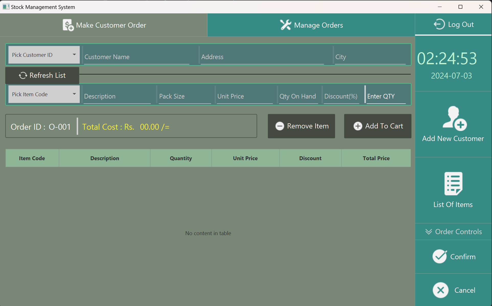

# Wholesale Management System

Simple Wholesale Management System using Java, JavaFX, and MySQL for practice MVC architecture.

## Setup

1. Clone the repository
2. run the `WholesaleDB.sql` file in your MySQL database
3. change the database connection details in the `DbConnection.java` file
4. run the project

## Here are some screenshots of the application

### Login Screen

### Admin Dashboard

### Cashier Dashboard

